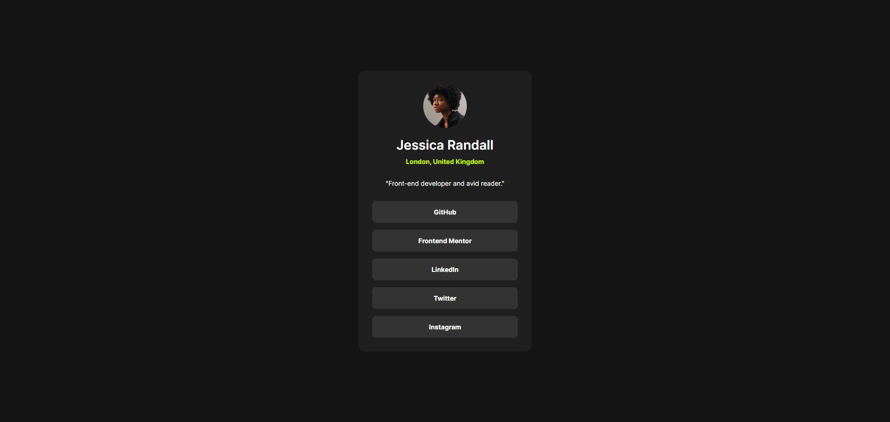

# Frontend Mentor - Social links profile solution

This is a solution to the [Social links profile challenge on Frontend Mentor](https://www.frontendmentor.io/challenges/social-links-profile-UG32l9m6dQ). Frontend Mentor challenges help you improve your coding skills by building realistic projects.

## Table of contents

- [Overview](#overview)
  - [Screenshot](#screenshot)
  - [Links](#links)
- [My process](#my-process)
  - [Built with](#built-with)
- [Author](#author)

## Overview

### Screenshot

### Links

- Solution URL: [GitHub](https://github.com/stephanievanoverberghe/social-links)
- Live Site URL: [GitHub Pages](https://stephanievanoverberghe.github.io/social-links/)

## My process

### Built with

- HTML5
- Preprocessor SASS
- Flexbox
- Mobile-first workflow

## Author

- Frontend Mentor - [L'Alchimiste](https://www.frontendmentor.io/profile/stephanievanoverberghe)
